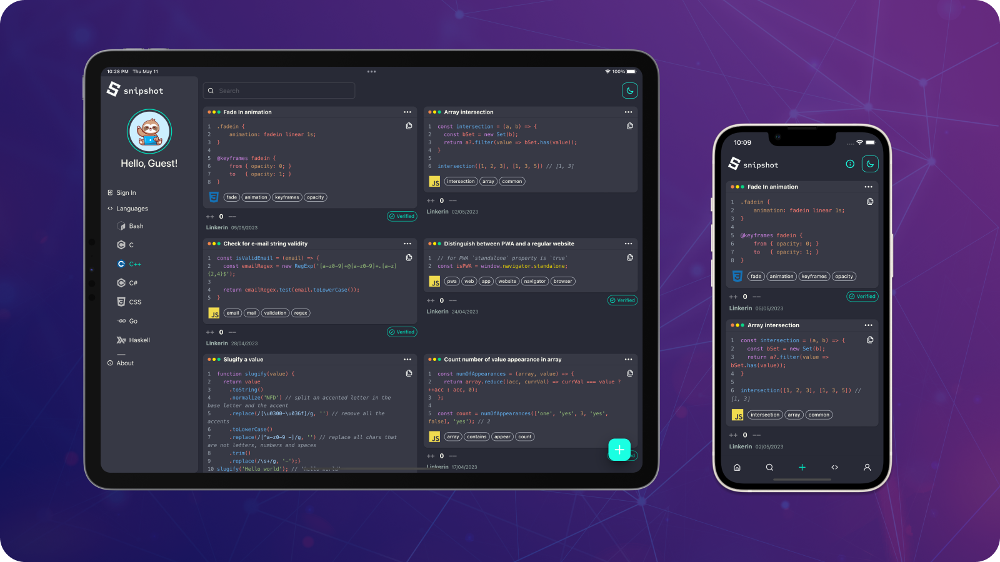

  

# snipshot.dev

[About us](#about)  
[Benefits of using snipshot](#benefits)  
[Technologies used ](#technologies)  
[Contacts](#contacts)

## About us 👨‍💻 

`snipshot` is an application for developers to **store** and **share** their favorite code snippets with others.

With `snipshot` your useful one-liners won't be forgotten. Futhermore, you can share your experience and ideas with others. Sounds like a source of **inspiration**, doesn't it?

Our platform is designed to be user-friendly and intuitive. Start using it [**now**](https://snipshot.dev/)!

## Benefits of using snipshot 👍 

- Save time by reusing code snippets instead of writing them from scratch
- Improve collaboration by sharing your code with other developers and getting feedback
- Get inspiration from other developers' code snippets and learn new techniques and approaches

## Technologies used ⌨️ 

At `snipshot`, we use cutting-edge technologies to create aa application that is powerful, flexible, and easy to use. Our tech stack includes:

- [Next.js](https://nextjs.org) and [TypeScript](https://www.typescriptlang.org) for a fast and responsive frontend that is less prone to errors.
- [Chakra UI](https://chakra-ui.com) for a beautiful and customizable UI.
- [Supabase](https://supabase.com) for a scalable, easy-to-use and secure backend.
- [Prisma](https://www.prisma.io) for a flexible and powerful database ORM that helps us manage complex database schemas and queries with ease.
- [ChatGPT](https://openai.com/blog/chatgpt) for content moderation to ensure that our application is free from abuse, malicious or harmful content.
- [Vercel](https://vercel.com) for scalable and reliable hosting.
- [Upstash](https://upstash.com) for serverless Redis.
- [Axiom](https://axiom.co) for advanced logging and analytics.

## Contacts 📨 

If you want to get in touch, we will be glad to receive your e-mail: [info@snipshot.dev](mailto:info@snipshot.dev) 😉.
